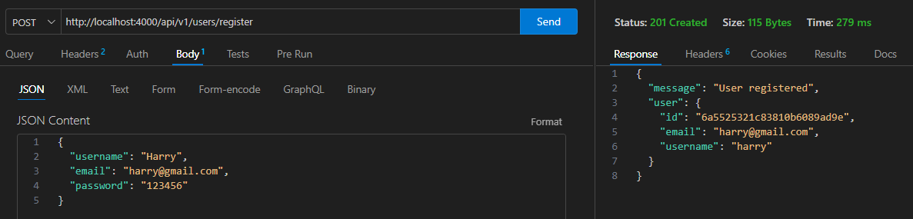
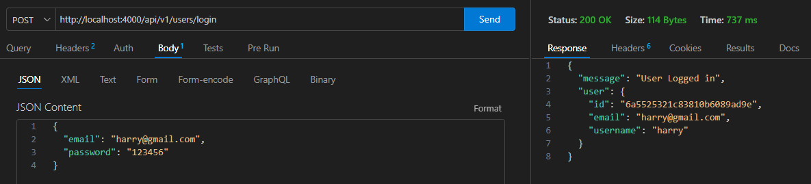
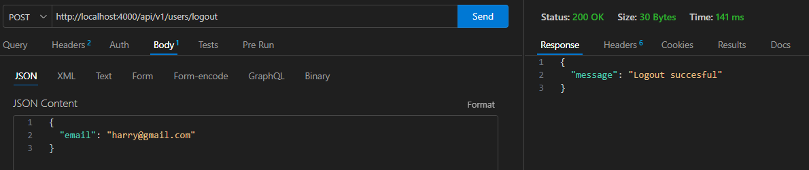
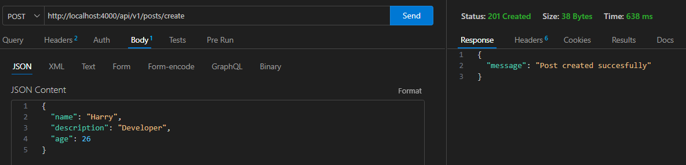
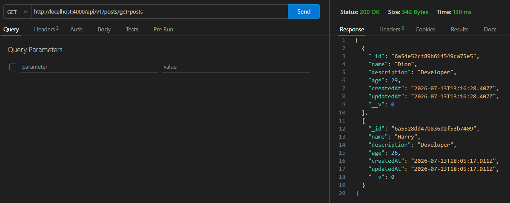
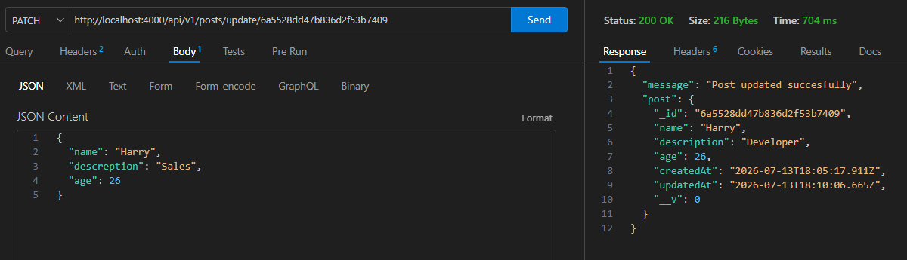
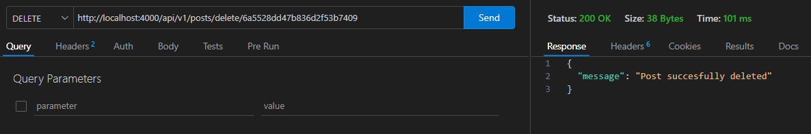

# REST API - Authentication & CRUD

## Overview

This project is a backend REST API built with Node.js, Express, and MongoDB.

It includes:

- User registration
- User login
- User logout
- CRUD operations
- Database integration with MongoDB

---

# Authentication

The API includes user authentication features:

- User registration
- User login
- User logout

## Register

## Login

## Logout

---

# CRUD Operations

The API supports CRUD functionality:

- Create
- Read
- Update
- Delete

## Create

## Read

## Update

## Delete

